<div align="center">

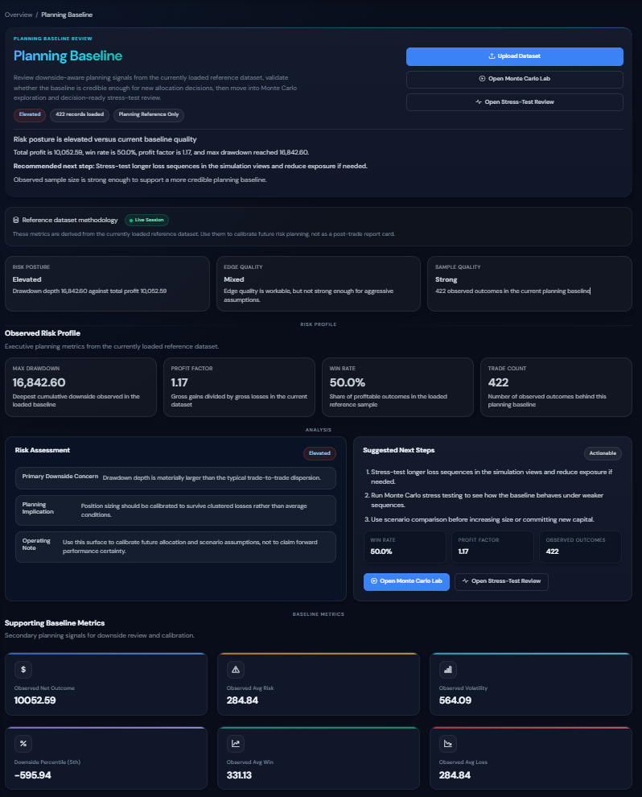

<br/>
<br/>

# RiskWise Planner

### Pre-Trade Risk Planning & Scenario Modelling

*Observed outcomes → planning metrics → simulation → scenario comparison → capital-preservation decisions*

<br/>


[](https://github.com/aminul-portfolio/riskwise-planner/actions/workflows/django-ci.yml)


</div>

---

## Overview

Most risk-related portfolio projects stop at isolated calculators or post-trade dashboards. **RiskWise Planner** goes further — it is structured as a pre-trade risk planning product that uses observed trade outcomes as reference inputs for downside-aware planning, simulation-backed review, and capital-preservation decisions.

> This is not a post-trade journal, a trading dashboard, or a calculator bundle.
> It is a planning-first risk product with methodology notes, threshold warnings, and simulation workflows.

---

## For Reviewers — Quick Navigation

| If you want to… | Go to |
|---|---|
| Understand the product and domain thinking | [Overview](#overview) · [Planning Workflow](#planning-workflow) |
| See the UI and feature depth | [Screenshots](#screenshots) |
| Review the architecture and code quality | [Architecture](#architecture) · [Project Structure](#project-structure) |
| Check testing and engineering discipline | [Testing & CI](#testing--ci) |
| Run the project locally | [Quick Start](#quick-start) |

**Best role fit** &nbsp; `Analytics Engineer (FinTech)` · `Data Engineer — Finance / Risk` · `Python / Django data-product roles` · `Product-focused Full-Stack Developer`

**Best industry fit** &nbsp; `FinTech` · `Risk Analytics` · `Quantitative Planning` · `Capital Markets Tooling` · `Trading Technology`

---

## What This Project Demonstrates

| Capability | Evidence |
|---|---|
| **Domain-specific product thinking** | Every page is framed around pre-trade planning, not generic CRUD or post-trade review |
| **Full-stack Django engineering** | Views, models, forms, templates, session handling, authentication, ownership isolation |
| **Simulation & analytics pipeline** | Monte Carlo simulation, equity curve generation, multi-scenario comparison |
| **Risk-product credibility** | Methodology notes, heuristic labels, threshold-based warnings, dataset provenance |
| **Premium UI execution** | Dark design system with glassmorphism, KPI cards, responsive sidebar, consistent visual hierarchy |
| **Software discipline** | 64 passing tests, 71% measured coverage, ownership isolation, CI workflow, reviewer documentation |

---

## Planning Workflow

RiskWise follows a six-stage pre-trade planning pipeline. Each stage feeds the next — the output of one step becomes the input context for the next decision surface.

```
┌─────────────────────────────────────────────────────────────────────────┐
│                        RiskWise Planning Pipeline                        │
├─────────────────────────────────────────────────────────────────────────┤
│                                                                         │
│   ① Upload              Ingest observed trade outcomes (CSV / XLSX)     │
│      │                  Validate structure, tag provenance              │
│      ▼                                                                  │
│   ② Planning Baseline   Derive win rate, profit factor, max drawdown   │
│      │                  Flag sample-quality risks, assign posture       │
│      ▼                                                                  │
│   ③ Monte Carlo Lab     N-path simulation from observed distribution   │
│      │                  Percentile equity curves, tail-risk stats       │
│      ▼                                                                  │
│   ④ Stress-Test         Worst-case drawdown scenarios                  │
│      │                  Threshold warnings, capital-at-risk framing     │
│      ▼                                                                  │
│   ⑤ Scenario Compare    Side-by-side parameter sweeps                  │
│      │                  Distribution overlays, downside comparison      │
│      ▼                                                                  │
│   ⑥ Archive & Review    Saved runs with audit trail                    │
│                         Chart snapshots, parameter provenance           │
│                                                                         │
└─────────────────────────────────────────────────────────────────────────┘
```

Each simulation run is stored with its full parameter set, source dataset reference, and generated charts — enabling reviewers to audit how a planning decision was reached.

---

## Architecture

```
┌─────────────────────────────────────────────────────────────────────────┐
│                             Client (Browser)                            │
│   Dark design system · Bootstrap 5 · DM Sans · Glassmorphism tokens    │
├─────────────────────────────────────────────────────────────────────────┤
│                                                                         │
│   Django Template Layer                                                 │
│   ┌──────────────────────────────────────────────────────────────────┐  │
│   │  base.html ──► home.html | dashboard.html | simulation pages   │  │
│   │  Partials: _sidebar_nav.html · _sidebar_auth.html              │  │
│   │  Block system:  ·     │  │
│   └──────────────────────────────────────────────────────────────────┘  │
│                                                                         │
│   Django Views (views.py)                                               │
│   ┌──────────────────────────────────────────────────────────────────┐  │
│   │  Form handlers · Session management · Ownership isolation       │  │
│   │  DRY helpers for chart rendering and metric formatting          │  │
│   │  @login_required guards on all planning surfaces                │  │
│   └──────────────────────────────────────────────────────────────────┘  │
│           │                              │                              │
│           ▼                              ▼                              │
│   ┌───────────────────┐   ┌──────────────────────────────────────────┐  │
│   │   Models (ORM)    │   │   Services (services.py)                │  │
│   │                   │   │                                          │  │
│   │  Dataset          │   │  Domain functions:                      │  │
│   │  SimulationRun    │   │  ├─ Monte Carlo engine                  │  │
│   │  ScenarioResult   │   │  ├─ Equity curve generation             │  │
│   │  ├─ validators    │   │  ├─ Stress-test calculations            │  │
│   │  ├─ indexes       │   │  ├─ Percentile extraction               │  │
│   │  ├─ computed      │   │  ├─ Risk metric derivation              │  │
│   │  │   properties   │   │  ├─ Heuristic labelling                 │  │
│   │  └─ run_type enum │   │  └─ Chart rendering (Matplotlib)        │  │
│   └───────────────────┘   └──────────────────────────────────────────┘  │
│           │                              │                              │
│           ▼                              ▼                              │
│   ┌──────────────────────────────────────────────────────────────────┐  │
│   │                   SQLite / PostgreSQL                            │  │
│   └──────────────────────────────────────────────────────────────────┘  │
│                                                                         │
└─────────────────────────────────────────────────────────────────────────┘
```

**Key architectural decisions:**

- **Views ↔ Services separation** — `views.py` handles HTTP concerns (forms, sessions, auth); `services.py` owns all domain logic (simulation, metrics, charting). No business logic leaks into the view layer.
- **Ownership isolation** — Every query is scoped to `request.user`. Users cannot access, modify, or view another user's datasets or simulation runs.
- **Session-scoped workflow** — The active dataset and run context are carried through Django sessions, enabling a multi-step planning flow without requiring URL-embedded state.
- **Computed model properties** — Risk metrics like profit factor and win rate are derived on access via `@property` methods rather than stored redundantly.

---

## Page Surfaces

Nine distinct pages map to the planning pipeline. Each has a specific role in the workflow:

| Surface | Purpose |
|---|---|
| **Homepage** | Product framing, reviewer path, value proposition |
| **Capital Preservation Dashboard** | KPI summary, downside posture, dynamic interpretation fields |
| **Upload Surface** | CSV/XLSX intake with structure validation and provenance tagging |
| **Planning Baseline** | Win rate, profit factor, drawdown, sample quality flags, posture assignment |
| **Monte Carlo Lab** | N-path simulation setup, percentile equity curves, result review |
| **Stress-Test Review** | Tail-risk framing, worst-case drawdown scenarios, threshold warnings |
| **Scenario Comparison** | Side-by-side parameter sweep, distribution comparison, downside evidence |
| **Saved Runs Archive** | Filterable run history with chart previews and run-type badges |
| **Run Detail** | Full audit view: parameters, results, charts, dataset provenance |

---

## Project Structure

```
riskwise-planner/
├── riskwise/                       # Django app
│   ├── models.py                   # Dataset, SimulationRun, ScenarioResult
│   ├── views.py                    # HTTP handlers, session flow, DRY helpers
│   ├── services.py                 # Domain functions (simulation, metrics, charts)
│   ├── forms.py                    # Upload + simulation parameter forms
│   ├── urls.py                     # Route definitions
│   ├── tests/                      # 64 tests — models, views, services, edge cases
│   ├── templates/riskwise/
│   │   ├── base.html               # Master layout with sidebar includes
│   │   ├── home.html               # Landing page
│   │   ├── dashboard.html          # Capital Preservation Dashboard
│   │   ├── partials/
│   │   │   ├── _sidebar_nav.html   # Grouped nav with active states + badges
│   │   │   └── _sidebar_auth.html  # Auth controls + session indicator
│   │   └── ...                     # Simulation, upload, archive templates
│   └── static/css/
│       ├── tokens.css              # Design tokens (colors, shadows, radii)
│       ├── style.css               # Global styles + Bootstrap dark overrides
│       ├── app-shell.css           # Sidebar, topbar, layout scaffold
│       ├── components.css          # KPI cards, chips, badges, skeleton loaders
│       └── pages/
│           ├── dashboard.css       # Dashboard-specific styles
│           ├── simulations.css     # Monte Carlo + stress-test pages
│           └── forms.css           # Upload + parameter form styles
├── config/                         # Django project settings
│   ├── settings.py
│   └── urls.py
├── .github/workflows/
│   └── django-ci.yml               # CI pipeline — test suite on push/PR
├── requirements.txt
└── README.md
```

---

## Screenshots

<details>
<summary><strong>Homepage</strong> — Product framing and reviewer path</summary>
<br>
<table width="100%" cellpadding="0" cellspacing="0" border="0"
       style="border:1px solid #1e2d45;border-radius:10px;overflow:hidden;background:#0e1420">
  <tr>
    <td width="50%" valign="top"
        style="padding:20px 12px 20px 20px;border-right:1px solid #1e2d45">
      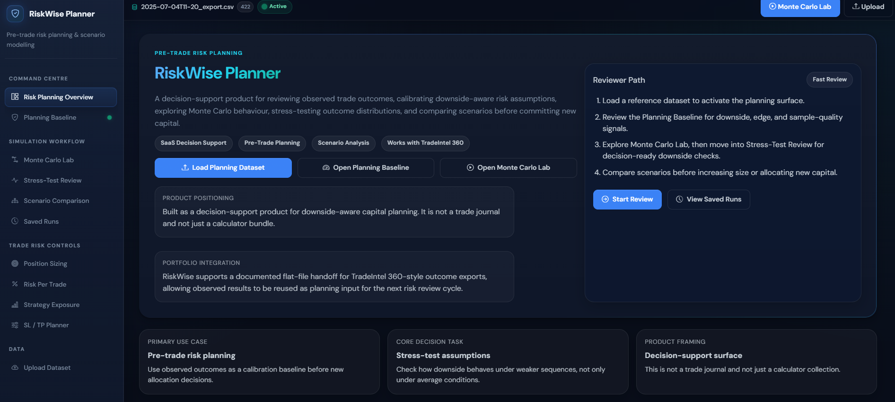
    </td>
    <td width="50%" valign="top"
        style="padding:20px 20px 20px 12px">
      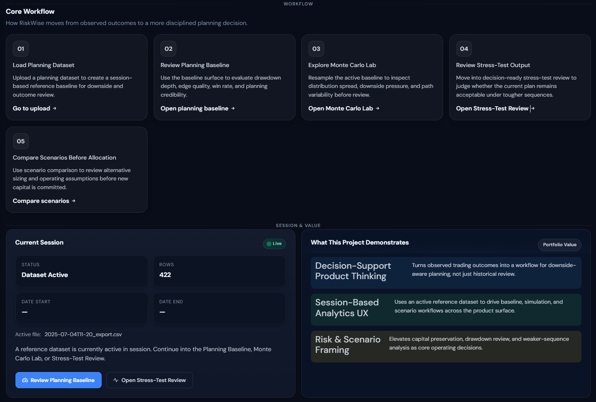
    </td>
  </tr>
  <tr>
    <td valign="top"
        style="padding:10px 12px 16px 20px;border-right:1px solid #1e2d45;border-top:1px solid #1e2d45">
      <sub><strong>Homepage hero</strong> — Product framing, reviewer path, positioning, and primary calls to action</sub>
    </td>
    <td valign="top"
        style="padding:10px 20px 16px 12px;border-top:1px solid #1e2d45">
      <sub><strong>Workflow and product value</strong> — Core workflow, active session context, and what the project demonstrates</sub>
    </td>
  </tr>
</table>
</details>

<details>
<summary><strong>Upload & Planning Baseline</strong> — Data intake and risk profile derivation</summary>
<br>
<table width="100%" cellpadding="0" cellspacing="0" border="0"
       style="border:1px solid #1e2d45;border-radius:10px;overflow:hidden;background:#0e1420">
  <tr>
    <td width="50%" valign="top"
        style="padding:20px 12px 20px 20px;border-right:1px solid #1e2d45">
      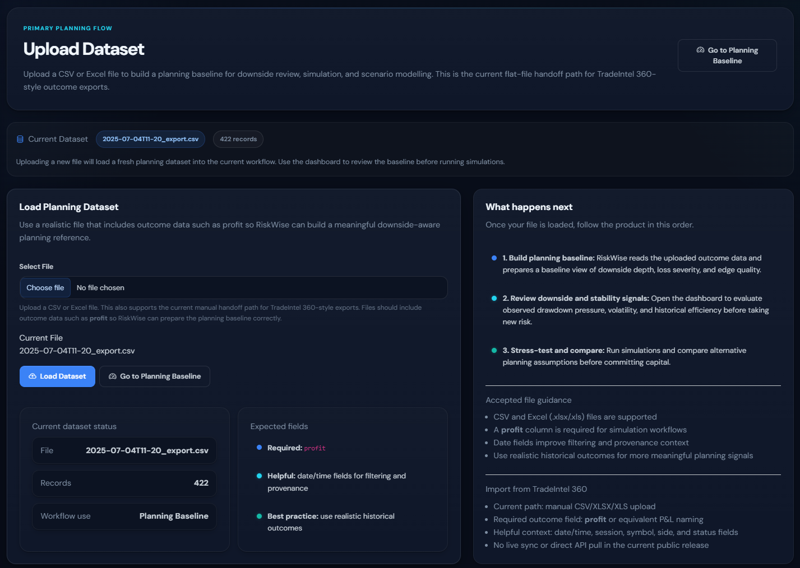
    </td>
    <td width="50%" valign="top"
        style="padding:20px 20px 20px 12px">
      
    </td>
  </tr>
  <tr>
    <td valign="top"
        style="padding:10px 12px 16px 20px;border-right:1px solid #1e2d45;border-top:1px solid #1e2d45">
      <sub><strong>Upload surface</strong> — Manual CSV/XLSX intake, dataset expectations, and documented TradeIntel-style flat-file handoff</sub>
    </td>
    <td valign="top"
        style="padding:10px 20px 16px 12px;border-top:1px solid #1e2d45">
      <sub><strong>Planning Baseline</strong> — Downside posture, sample quality, observed risk profile, and decision-ready next steps</sub>
    </td>
  </tr>
</table>
</details>

<details>
<summary><strong>Monte Carlo & Stress-Test</strong> — Simulation engine and tail-risk review</summary>
<br>
<table width="100%" cellpadding="0" cellspacing="0" border="0"
       style="border:1px solid #1e2d45;border-radius:10px;overflow:hidden;background:#0e1420">
  <tr>
    <td width="50%" valign="top"
        style="padding:20px 12px 20px 20px;border-right:1px solid #1e2d45">
      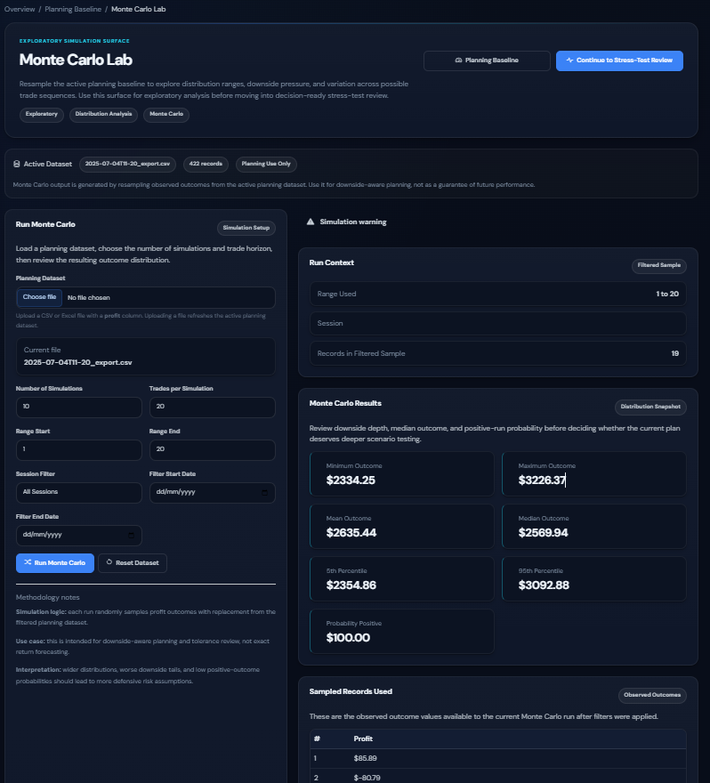
    </td>
    <td width="50%" valign="top"
        style="padding:20px 20px 20px 12px">
      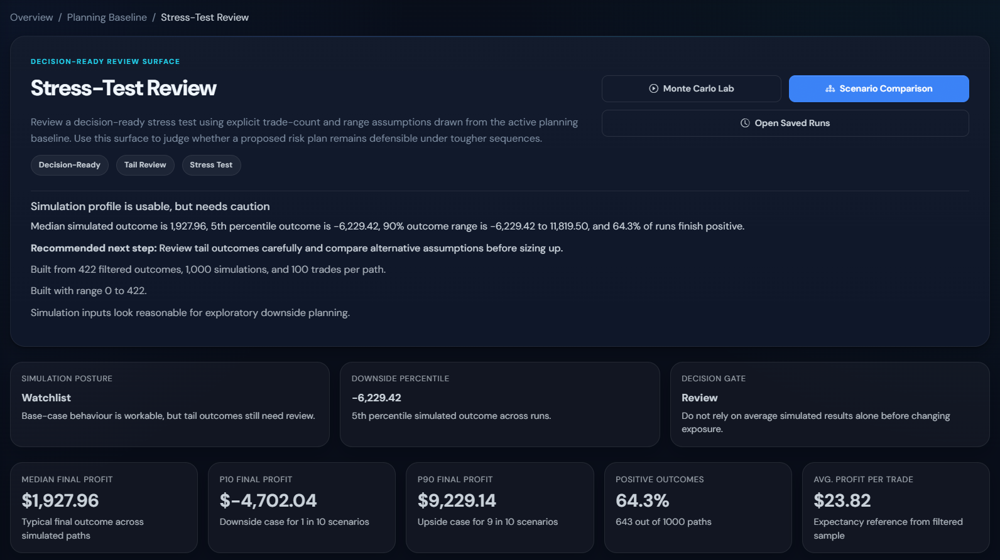
    </td>
  </tr>
  <tr>
    <td valign="top"
        style="padding:10px 12px 16px 20px;border-right:1px solid #1e2d45;border-top:1px solid #1e2d45">
      <sub><strong>Monte Carlo Lab</strong> — Filtered-sample run context, simulation result cards, and sampled-record review</sub>
    </td>
    <td valign="top"
        style="padding:10px 20px 16px 12px;border-top:1px solid #1e2d45">
      <sub><strong>Stress-Test Review</strong> — Decision-ready downside summary with tail-risk framing and simulation KPIs</sub>
    </td>
  </tr>
</table>
</details>

<details>
<summary><strong>Scenario Comparison</strong> — Side-by-side parameter sweep and distribution evidence</summary>
<br>
<table width="100%" cellpadding="0" cellspacing="0" border="0"
       style="border:1px solid #1e2d45;border-radius:10px;overflow:hidden;background:#0e1420">
  <tr>
    <td width="50%" valign="top"
        style="padding:20px 12px 20px 20px;border-right:1px solid #1e2d45">
      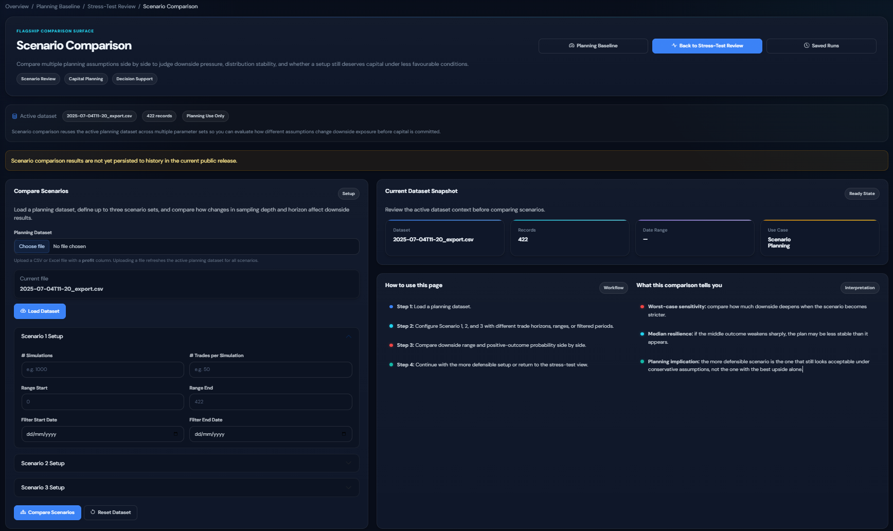
    </td>
    <td width="50%" valign="top"
        style="padding:20px 20px 20px 12px">
      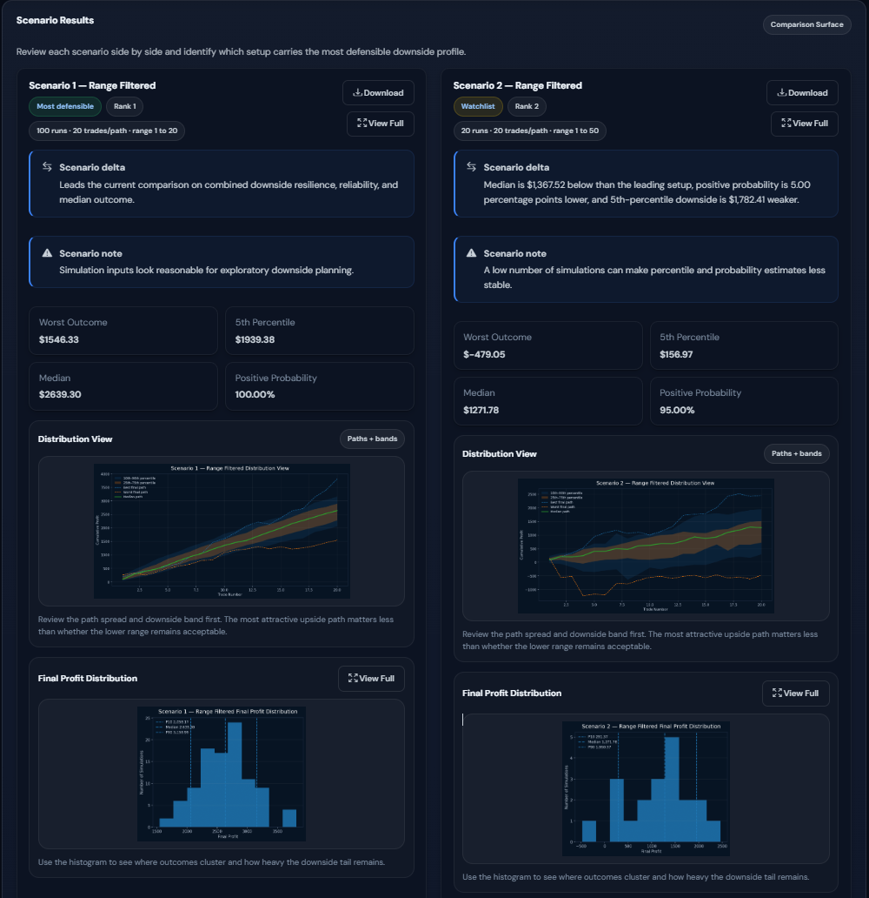
    </td>
  </tr>
  <tr>
    <td valign="top"
        style="padding:10px 12px 16px 20px;border-right:1px solid #1e2d45;border-top:1px solid #1e2d45">
      <sub><strong>Scenario comparison setup</strong> — Dataset context, scenario configuration, and comparison framing before results are generated</sub>
    </td>
    <td valign="top"
        style="padding:10px 20px 16px 12px;border-top:1px solid #1e2d45">
      <sub><strong>Scenario comparison results</strong> — Side-by-side downside, percentile, and distribution evidence across competing planning setups</sub>
    </td>
  </tr>
</table>
</details>

<details>
<summary><strong>Modal Review Surfaces</strong> — Distribution and histogram deep-dives</summary>
<br>
<table width="100%" cellpadding="0" cellspacing="0" border="0"
       style="border:1px solid #1e2d45;border-radius:10px;overflow:hidden;background:#0e1420">
  <tr>
    <td width="50%" valign="top"
        style="padding:20px 12px 20px 20px;border-right:1px solid #1e2d45">
      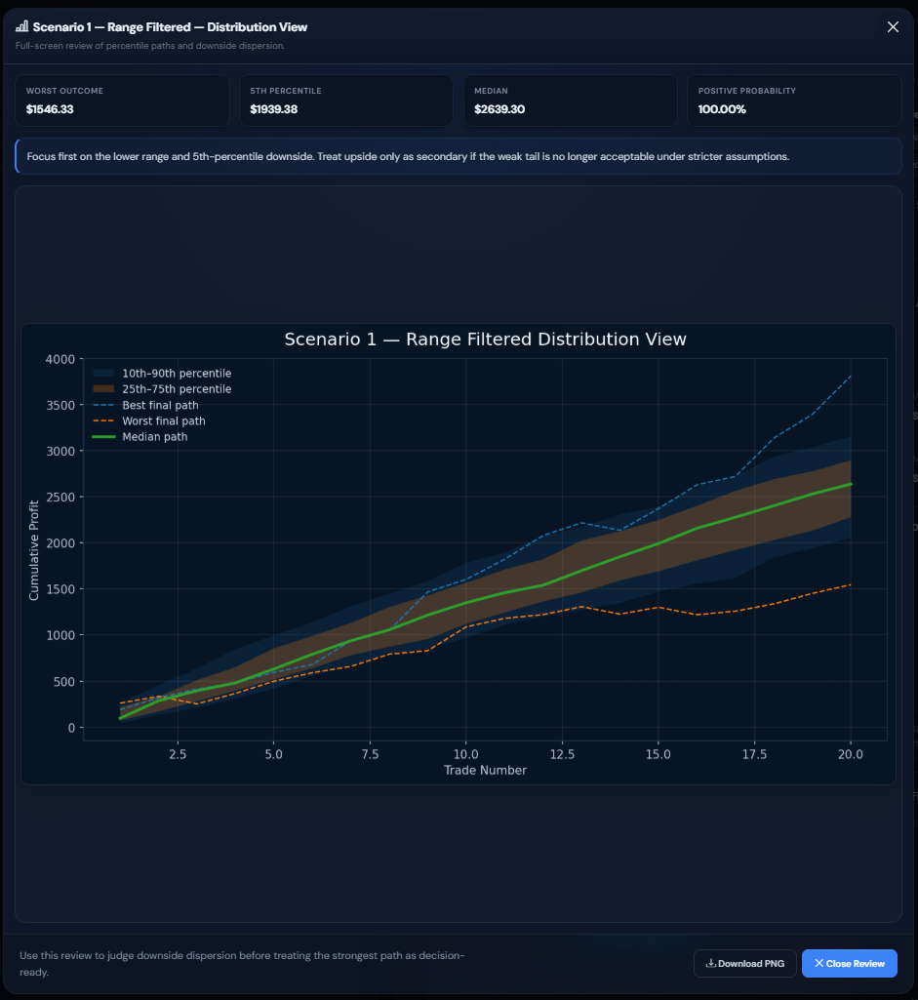
    </td>
    <td width="50%" valign="top"
        style="padding:20px 20px 20px 12px">
      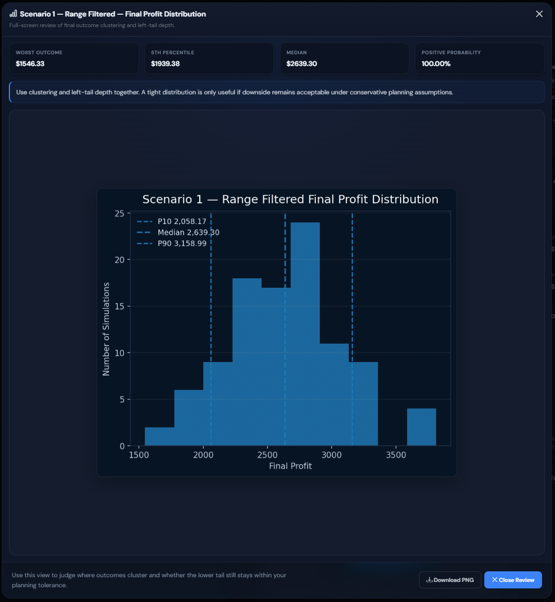
    </td>
  </tr>
  <tr>
    <td valign="top"
        style="padding:10px 12px 16px 20px;border-right:1px solid #1e2d45;border-top:1px solid #1e2d45">
      <sub><strong>Distribution view modal</strong> — Percentile-path review with downside dispersion, best/worst paths, and quick decision stats</sub>
    </td>
    <td valign="top"
        style="padding:10px 20px 16px 12px;border-top:1px solid #1e2d45">
      <sub><strong>Final profit distribution modal</strong> — Histogram review showing clustering, left-tail depth, and conservative planning context</sub>
    </td>
  </tr>
</table>
</details>

<details>
<summary><strong>Archive & Audit</strong> — Saved runs, detail views, and parameter provenance</summary>
<br>
<table width="100%" cellpadding="0" cellspacing="0" border="0"
       style="border:1px solid #1e2d45;border-radius:10px;overflow:hidden;background:#0e1420">
  <tr>
    <td width="50%" valign="top"
        style="padding:20px 12px 20px 20px;border-right:1px solid #1e2d45">
      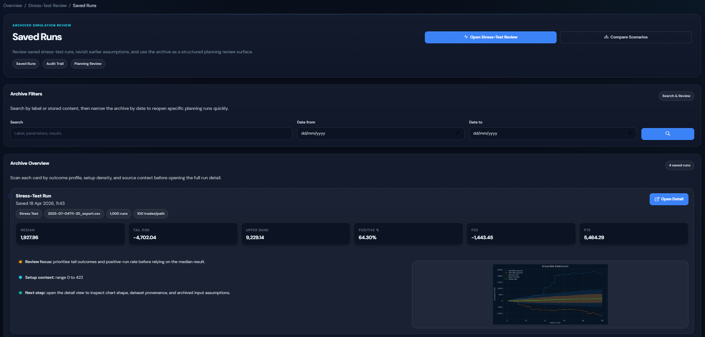
    </td>
    <td width="50%" valign="top"
        style="padding:20px 20px 20px 12px">
      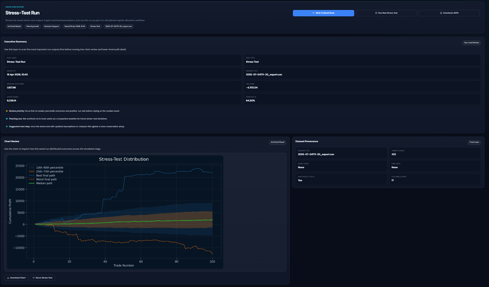
    </td>
  </tr>
  <tr>
    <td valign="top"
        style="padding:10px 12px 16px 20px;border-right:1px solid #1e2d45;border-top:1px solid #1e2d45">
      <sub><strong>Saved Runs</strong> — Archive filters, run summaries, and chart previews for structured review and retrieval</sub>
    </td>
    <td valign="top"
        style="padding:10px 20px 16px 12px;border-top:1px solid #1e2d45">
      <sub><strong>Run detail view</strong> — Archived run summary, chart review, provenance, and reviewer-facing run controls</sub>
    </td>
  </tr>
</table>
<br>
<table width="100%" cellpadding="0" cellspacing="0" border="0"
       style="border:1px solid #1e2d45;border-radius:10px;overflow:hidden;background:#0e1420">
  <tr>
    <td valign="top" style="padding:20px">
      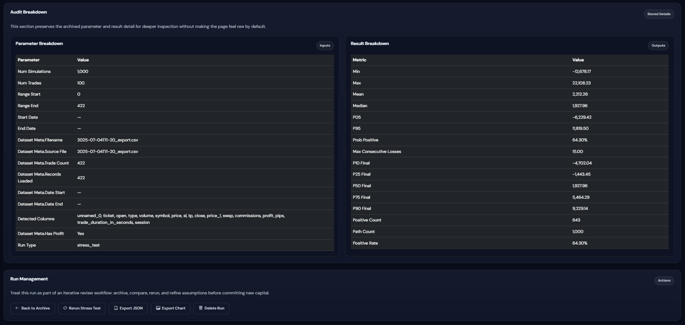
    </td>
  </tr>
  <tr>
    <td valign="top" style="padding:10px 20px 16px 20px;border-top:1px solid #1e2d45">
      <sub><strong>Audit breakdown</strong> — Stored parameter and result detail for deeper technical inspection without making the primary run view feel too raw</sub>
    </td>
  </tr>
</table>
</details>

---

## Testing & CI

The project maintains **64 passing tests** across models, views, services, and edge cases, with **71% measured coverage**.

```
python manage.py test

======================================================================
Ran 64 tests

OK
```

**What's tested:**

- **Model layer** — Validators, computed properties, ownership scoping, enum constraints
- **View layer** — Auth guards, form validation, session flow, redirect logic, ownership isolation (cross-user access returns 404)
- **Service layer** — Monte Carlo output shape and bounds, metric derivation accuracy, edge cases (empty datasets, single-record inputs)
- **Integration** — Upload → baseline → simulation → archive round-trip

**CI pipeline** — GitHub Actions runs the full test suite on every push and pull request via `.github/workflows/django-ci.yml`.

---

## Quick Start

```bash
# Clone the repository
git clone https://github.com/aminul-portfolio/riskwise-planner.git
cd riskwise-planner

# Create and activate a virtual environment
python -m venv .venv
source .venv/bin/activate        # Windows: .venv\Scripts\activate

# Install dependencies
pip install -r requirements.txt

# Apply migrations
python manage.py migrate

# Create a superuser (for access to all features)
python manage.py createsuperuser

# Run the development server
python manage.py runserver
```

Then open `http://127.0.0.1:8000/` in your browser.

**Demo data** — To populate the app with a pre-built dataset and sample simulation runs for review:

```bash
python manage.py seed_demo
```

This creates a demo user with a complete planning session already in place — upload, baseline, Monte Carlo run, and saved results — so reviewers can explore the full product without manual setup.

---

## How to Review This Project

1. Open the **Homepage** — read the product framing and value proposition
2. Navigate to the **Upload Surface** — review the dataset intake and schema expectations
3. Open the **Planning Baseline** — see how observed outcomes become risk metrics
4. Run a **Monte Carlo simulation** — explore percentile equity curves and tail-risk stats
5. Run a **Stress-Test** — review worst-case drawdown framing and threshold warnings
6. Open **Scenario Comparison** — compare parameter setups side by side
7. Browse **Saved Runs** — filter, open a run detail, and inspect the audit breakdown

For a structured reviewer walkthrough, see [`docs/REVIEW_GUIDE.md`](docs/REVIEW_GUIDE.md).

---

## Tech Stack

| Layer | Technology | Role |
|---|---|---|
| **Backend** | Django 5.x, Python 3.11 | Application framework, ORM, auth, session management |
| **Data processing** | Pandas, NumPy | Dataset ingestion, metric derivation, simulation engine |
| **Charting** | Matplotlib | Equity curves, histograms, distribution plots |
| **Frontend** | Bootstrap 5 (dark), DM Sans | Responsive layout, dark design system |
| **CSS architecture** | Token-based multi-file system | `tokens.css` → `style.css` → `components.css` → page-specific |
| **Database** | SQLite (dev) / PostgreSQL (prod-ready) | ORM-abstracted storage layer |
| **CI** | GitHub Actions | Automated test suite on push/PR |

---

## Design System

The UI follows a dark premium design language with strict colour semantics:

- **Background** — `#080d19` base with layered `rgba` borders
- **Accent palette** — Blue / cyan / teal for primary actions and data visualisation
- **Warning palette** — Orange / red strictly for risk warnings and threshold alerts
- **Health palette** — Green only for controlled / healthy status indicators
- **Typography** — DM Sans with a four-tier font-size scale
- **Effects** — Glassmorphism surfaces, animated gradient borders, staggered entrance animations, skeleton shimmer loading states
- **Shadow system** — Four tiers: `sm` / `md` / `lg` / `glow` defined in `tokens.css`

---

## Portfolio Context

RiskWise Planner is one of four projects in a FinTech portfolio. Each project covers a distinct layer of the analytics stack:

| Project | Domain | Layer |
|---|---|---|
| **DataBridge** | Data integration | Ingestion & pipeline |
| **MarketVista** | Market analytics | Exploration & insight |
| **RiskWise Planner** | Pre-trade risk | Planning & simulation |
| **TradeIntel 360** | Trade intelligence | Execution & review |

RiskWise is positioned specifically as the **pre-trade planning** layer — it sits between market analysis and trade execution, using observed outcomes to inform forward-looking risk decisions.

**Integration path** — RiskWise sits in the sequence `DataBridge → RiskWise → TradeIntel 360`. It currently supports manual CSV/XLSX handoff from TradeIntel-style flat-file exports. Direct sync between projects is not yet supported. See [`docs/INTEGRATION.md`](docs/INTEGRATION.md) for schema expectations and handoff documentation.

---

## Roadmap

- [ ] Plotly interactive charts for richer in-browser data exploration
- [ ] Split `views.py` into a views package for maintainability
- [ ] Docker packaging and deployment guide
- [ ] API endpoints for headless simulation runs

---

## License

Licensed under the MIT License. See [LICENSE](LICENSE).
