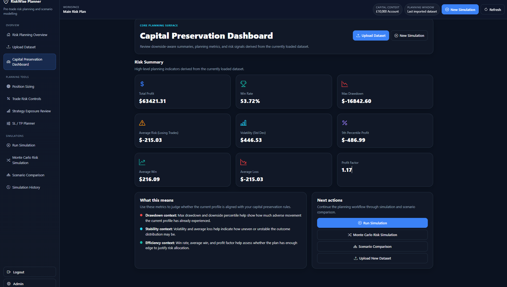
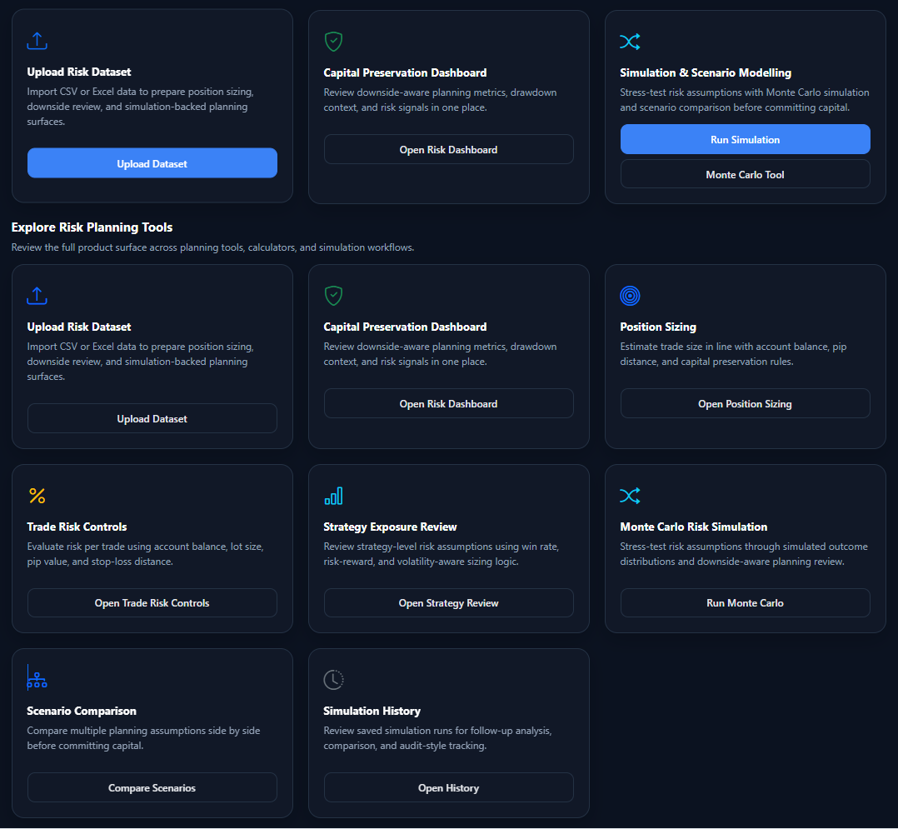
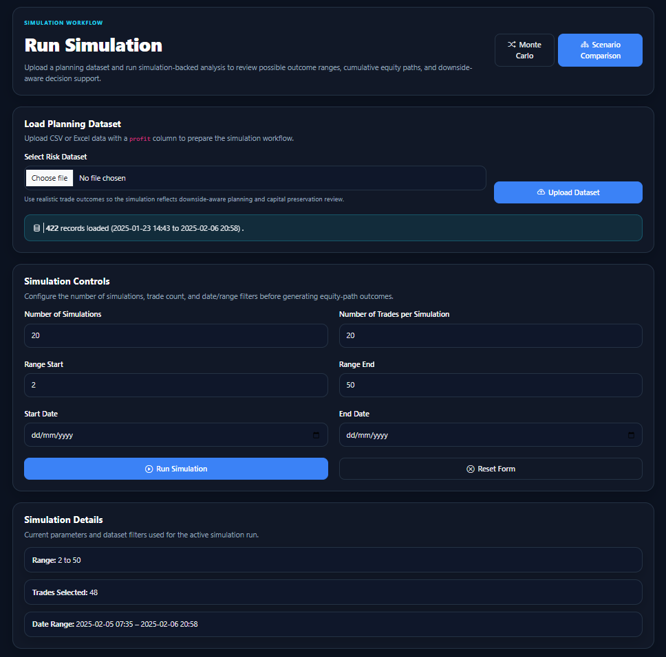
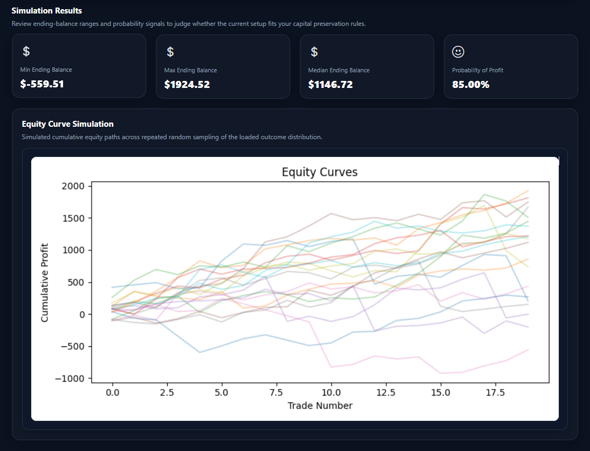

<div align="center">



<br/>
<br/>

# RiskWise Planner

### Pre-Trade Risk Planning & Scenario Modelling

*Observed outcomes → planning metrics → simulation → scenario comparison → capital-preservation decisions*

<br/>


</div>

---

## Overview

Most risk-related portfolio projects stop at isolated calculators or post-trade dashboards. **RiskWise Planner** goes further — it is structured as a pre-trade risk planning product that uses observed trade outcomes as reference inputs for downside-aware planning, simulation-backed review, and capital-preservation decisions.

> This is not a post-trade journal, a trading dashboard, or a calculator bundle.
> It is a planning-first risk product with methodology notes, threshold warnings, and simulation workflows.

**Best role fit**

`Analytics Engineer (FinTech)` &nbsp; `Data Engineer — Finance / Risk` &nbsp; `Python / Django data-product roles` &nbsp; `Product-focused Full-Stack Developer`

**Best industry fit**

`FinTech` &nbsp; `Risk Analytics` &nbsp; `Quantitative Planning` &nbsp; `Capital Markets Tooling` &nbsp; `Trading Technology`

---

## What This Project Demonstrates

| Capability | Evidence |
|---|---|
| **Domain-specific product thinking** | Every page is framed around pre-trade planning, not generic CRUD or post-trade review |
| **Full-stack Django engineering** | Views, models, forms, templates, session handling, authentication, ownership isolation |
| **Simulation & analytics pipeline** | Monte Carlo simulation, equity curve generation, multi-scenario comparison |
| **Risk-product credibility** | Methodology notes, heuristic labels, threshold-based warnings, dataset provenance |
| **Premium UI execution** | Dark design system, KPI cards, responsive sidebar, consistent visual hierarchy |
| **Software discipline** | 38 tests in suite, ownership isolation, reviewer documentation, public-release cleanup controls |

---

## Screenshots

<br>

<!-- Row 1: Homepage + Dashboard -->
<table width="100%" cellpadding="0" cellspacing="0" border="0"
       style="border:1px solid #1e2d45;border-radius:10px;overflow:hidden;background:#0e1420">
  <tr>
    <td width="50%" valign="top"
        style="padding:20px 12px 20px 20px;border-right:1px solid #1e2d45">
      
    </td>
    <td width="50%" valign="top"
        style="padding:20px 20px 20px 12px">
      
    </td>
  </tr>
  <tr>
    <td valign="top"
        style="padding:10px 12px 16px 20px;border-right:1px solid #1e2d45;border-top:1px solid #1e2d45">
      <sub><strong>Risk Planning Overview</strong><br>
      Product homepage with core workflow cards and full planning tool surface</sub>
    </td>
    <td valign="top"
        style="padding:10px 20px 16px 12px;border-top:1px solid #1e2d45">
      <sub><strong>Capital Preservation Dashboard</strong><br>
      Observed risk metrics with dataset provenance, interpretation context, and next actions</sub>
    </td>
  </tr>
</table>

<br>

<!-- Row 2: Monte Carlo + Scenario Comparison -->
<table width="100%" cellpadding="0" cellspacing="0" border="0"
       style="border:1px solid #1e2d45;border-radius:10px;overflow:hidden;background:#0e1420">
  <tr>
    <td width="50%" valign="top"
        style="padding:20px 12px 20px 20px;border-right:1px solid #1e2d45">
      
    </td>
    <td width="50%" valign="top"
        style="padding:20px 20px 20px 12px">
      
    </td>
  </tr>
  <tr>
    <td valign="top"
        style="padding:10px 12px 16px 20px;border-right:1px solid #1e2d45;border-top:1px solid #1e2d45">
      <sub><strong>Monte Carlo Risk Simulation</strong><br>
      Randomised outcome distributions with session filters, date ranges, and dark-themed equity curves</sub>
    </td>
    <td valign="top"
        style="padding:10px 20px 16px 12px;border-top:1px solid #1e2d45">
      <sub><strong>Scenario Comparison</strong><br>
      Side-by-side comparison of up to three planning assumptions with independent statistics</sub>
    </td>
  </tr>
</table>

<br>

---

## Core Features

<details>
<summary><b>Capital Preservation Dashboard</b></summary>

- Observed risk metrics: net outcome, win rate, max drawdown, volatility, profit factor
- Dataset provenance banner showing record count, date range, and planning-reference label
- Interpretation context explaining drawdown, stability, and efficiency signals
- Guided next-action flow into simulation and scenario workflows

</details>

<details>
<summary><b>Planning Tools</b></summary>

- **Position Sizing** — estimate position dollar value with methodology notes
- **Trade Risk Controls** — risk per trade with threshold-based warnings (caution / elevated / high risk)
- **Strategy Exposure Review** — heuristic sizing signal, explicitly labelled as a planning heuristic
- **SL / TP Planner** — risk, reward, and R:R ratio with limitation notes

</details>

<details>
<summary><b>Simulation & Scenario Modelling</b></summary>

- Monte Carlo simulation with configurable trade counts, date filters, and session filtering
- Dark-themed equity curve chart generation
- Scenario comparison with up to three independent parameter sets
- Saved simulation history with search, date filtering, tags, and pagination

</details>

<details>
<summary><b>Risk-Product Credibility</b></summary>

- Methodology & Assumptions sections on every calculator and simulation page
- Heuristic formulas clearly labelled with scaling-factor explanations
- Threshold-based risk warnings that adapt to the calculated exposure level
- Dataset provenance visible across all planning surfaces

</details>

---

## Risk Workflow

```
Upload Dataset → Capital Preservation Dashboard → Planning Tools
                                                     ↓
                                              Position Sizing
                                              Trade Risk Controls
                                              Strategy Exposure Review
                                              SL / TP Planner
                                                     ↓
                                              Run Simulation → Monte Carlo
                                                     ↓
                                              Scenario Comparison
                                                     ↓
                                              Simulation History → Detail / Export
```

---

## Tech Stack

| Layer | Technology |
|---|---|
| Backend | Python 3, Django 5 |
| Data processing | Pandas, NumPy |
| Visualisation | Matplotlib (dark theme) |
| Auth | Django auth, login-required protection, ownership isolation |
| Database | SQLite (local), PostgreSQL-ready |
| Testing | Django TestCase — 38 tests in suite |
| UI | Bootstrap 5 (dark-overridden), custom CSS design system |

---

## Local Setup

```bash
git clone https://github.com/aminul-portfolio/riskwise-planner.git
cd riskwise-planner

python -m venv .venv
source .venv/bin/activate          # Windows: .venv\Scripts\Activate.ps1

pip install -r requirements.txt
python manage.py migrate
python manage.py createsuperuser
python manage.py runserver
```

Visit `http://127.0.0.1:8000`, log in, and upload a trade dataset to begin.

**Expected input:** CSV or XLSX with a `profit` column and common trade fields (date, symbol, volume, entry_price, exit_price, account_type).

---

## Verification

```bash
python manage.py check   # Django system check — must pass
python manage.py test    # 38 tests in suite — verify locally before release
```

---

## How to Review This Project

See [`docs/REVIEW_GUIDE.md`](docs/REVIEW_GUIDE.md) for the recommended 14-step walkthrough.

**Quick review path:**

| # | Surface | What to notice |
|---|---|---|
| 1 | **Homepage** | Pre-trade positioning, core workflow cards, product language |
| 2 | **Upload → Dashboard** | Observed metrics, provenance banner, interpretation context |
| 3 | **Trade Risk Controls** | Threshold warnings (caution / elevated / high) |
| 4 | **Strategy Exposure Review** | Heuristic formula clearly labelled |
| 5 | **Monte Carlo Simulation** | Distribution analysis with dark-themed charts |
| 6 | **Scenario Comparison** | Side-by-side planning assumptions |
| 7 | **Simulation History → Detail** | Structured KPI cards, JSON/chart download |

---

## Portfolio Context

RiskWise Planner is the **pre-trade decision-support** product in my FinTech project sequence:

- [DataBridge Market API](https://github.com/aminul-portfolio/databridge-market-api) — market data ingestion, ETL, normalized storage, API delivery
- **RiskWise Planner** — pre-trade risk planning, Monte Carlo simulation, stress-test review, scenario comparison
- [TradeIntel 360](https://github.com/aminul-portfolio/tradeintel-360) — post-trade performance analytics, KPI reporting, and review/export workflow

This positions RiskWise between upstream market data delivery and post-trade analytics as the decision-support layer in the FinTech workflow.

---

## Interview Story

> *"I built RiskWise to address a gap in trading and risk tooling: many tools stop at isolated calculators or post-trade review, but very few support structured pre-trade planning. RiskWise connects observed dataset context, planning controls, Monte Carlo exploration, stress-test review, and scenario comparison into a single decision-support workflow. In my portfolio, it sits between upstream data products and post-trade analytics as the pre-trade decision-support layer."*

---

## Target Roles

Data Analyst (Finance / Risk) · Analytics Engineer (FinTech) · Data Engineer — Risk / Capital Markets · Python/Django data-product roles · Quantitative planning and simulation workflows in finance environments

---

## Author

**Aminul Islam**

- GitHub: [aminul-portfolio](https://github.com/aminul-portfolio)
- LinkedIn: [aminul-islam](https://www.linkedin.com/in/aminul-islam-a71a871a2)

*This repository is shared for portfolio and review purposes.*

---

## License

Licensed under the MIT License. See [`LICENSE`](LICENSE).
